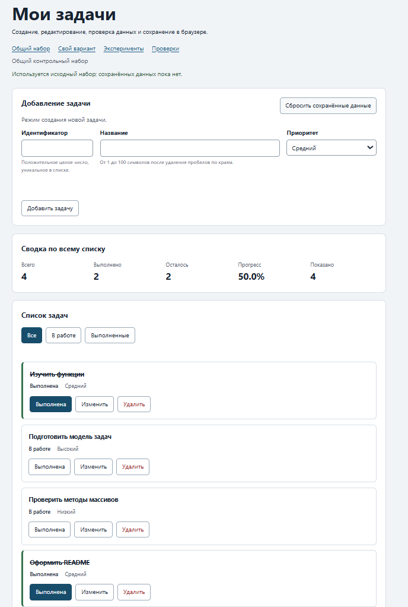

# Практическая работа № 4. Формы, валидация и локальное хранение данных

## Данные работы

**Имя:** Матушкин Леонид Федорович 
**Группа:** ЭФБО-05-25
**Вариант:** 2 
**Операционная система:** Windows 11
**Node.js:** v24.21.0  
**npm:** 11.19.0


## Запуск

Рабочая папка: `practice-04` внутри личного репозитория.

```bash
npm test
npm start
```

Устанавливать зависимости через `npm install` не требуется.

```text
http://127.0.0.1:5504/
http://127.0.0.1:5504/index.html?dataset=variant
http://127.0.0.1:5504/examples/forms-storage.html
http://127.0.0.1:5504/checks.html
```

Если использован другой порт, указать фактическую команду и адрес.

## Перенос результата ПР3

| Файл | Что перенесено или изменено |
|---|---|
| `data.js` | Перенесено без изменений: общий набор `demoTasks` и вариант 2 (`variantTasks`, шесть задач с id `[11, 23, 37, 41, 58, 64]`, тема «Подготовка выступления»). |
| `task-service.js` | Перенесены все 9 функций ПР2 без изменений, добавлена `updateTask` (проверяет id, существование задачи, title и priority; меняет только `title` и `priority`, `completed` берётся из существующей задачи через spread и не трогается). |
| `task-selectors.js` | Перенесена `getVisibleTasks` без изменений (all/pending/completed). |
| `task-view.js` | Перенесены `createTaskElement`, `renderTaskList`, `renderSummary`, `renderEmptyState`; в карточку добавлена третья кнопка `data-action="edit"` с `span.action-label` и текстом «Изменить», остальные две кнопки (`toggle`, `delete`) и правило `textContent` для названия сохранены как в ПР3. |

Исправлений при переносе не потребовалось: `npm run check:service` сразу показал 35 пройденных сценариев, 0 ошибок.

## Эксперименты с формой и хранилищем

| № | До запуска: прогноз | После запуска: результат | Объяснение |
|---:|---|---|---|
| 1. Пустое обязательное поле | Браузер заблокирует отправку ещё до обработчика `submit`, журнал не изменится | `validity.valid` поля = `false`; журнал остался «Действия ещё не выполнялись» | HTML-ограничение `required` проверяется браузером раньше, чем успевает сработать обработчик `submit`. Наблюдение именно такое, как предупреждает методичка - это не поломка страницы |
| 2. Название из пробелов | `submit` сработает (required формально выполнен), но прикладная проверка отклонит значение | Журнал: «submit получен, но прикладная проверка отклонила значение.» | `required` считает строку из пробелов непустой - браузер её пропускает. Отклоняет уже код, через `trim().length === 0` и `setCustomValidity` |
| 3. Типы значений `FormData` | `rawTitle` - строка; `event.defaultPrevented` - `true`; название после `trim` без краевых пробелов | `submit.defaultPrevented: true`; `typeof FormData title: string`; сохранённое `title: "Моя задача"` (пробелы по краям убраны) | `FormData.get()` всегда возвращает строку (или `null`, если поля нет); `preventDefault()` отменяет переход браузера, но не останавливает обработчик |
| 4. Строка в `localStorage` и JSON | `getItem` вернёт строку JSON, `typeof` этой строки - `string`; `JSON.parse` восстановит исходный объект | `typeof localStorage value: string`; `JSON.parse` вернул `{ title: "Моя задача", priority: "high" }` | `localStorage` физически хранит только строки. Объект превращается в строку через `JSON.stringify` при записи и обратно через `JSON.parse` при чтении - сам по себе он объект не хранит |
| 5. Повреждённый JSON | `JSON.parse` бросит исключение, без `try/catch` страница упадёт | Журнал: «JSON.parse завершился ошибкой: Expected property name or '}' in JSON at position 1» | Синтаксически неверная строка не парсится. Это и есть причина, почему `loadTasks` в `task-storage.js` оборачивает `JSON.parse` в `try/catch` и не доверяет содержимому `localStorage` вслепую |

## Организация кода

- `task-service.js` - создание задачи и операции, не меняющие вход (`addTask`, `setTaskCompleted`, `renameTask`, `removeTask`, новая `updateTask`). Про DOM, форму и `localStorage` здесь ничего не знает.
- `form-validation.js` - одна чистая функция `validateTaskDraft`. Принимает обычные данные (`draft`, `tasks`, `editingId`), ничего не читает из `document` и не показывает сообщений - только возвращает `{ ok, value }` или `{ ok: false, errors }`.
- `task-storage.js` - вся граница с `localStorage`: `isValidTaskList` (проверка схемы), `loadTasks`, `saveTasks`, `removeSavedTasks`. Здесь же перехватываются все исключения, чтобы они не вылетали наружу в `main.js`.
- `task-view.js` - создаёт DOM (карточки, список, сводку, пустое состояние), но не трогает данные и не пишет в хранилище.
- `main.js` - единственное место, где живёт состояние (`currentTasks`, `currentFilter`, `editingId`) и где эти слои соединяются: обработчик берёт данные из формы или клика → проверяет через `form-validation.js` → меняет данные через `task-service.js` → сохраняет через `task-storage.js` → перерисовывает через `task-view.js`.

**Почему функции хранения получают `storage` аргументом, а не берут `window.localStorage` сами:** так модуль можно проверить без браузера - `modules.checks.js` подсовывает ему `MemoryStorage`, простой объект с `getItem`/`setItem`/`removeItem` в памяти. Если бы функция сама обращалась к `window.localStorage`, её нельзя было бы запустить в Node.js и пришлось бы либо ставить библиотеку-имитацию, либо проверять только руками в браузере.

**Почему данные из JSON проверяются до использования:** `JSON.parse` гарантирует только то, что строка синтаксически правильный JSON - он может быть числом, `null`, объектом без поля `tasks` или с заведомо неверными задачами (отрицательный id, задача без названия и т.д.). Если использовать такие данные напрямую, всё остальное приложение (отрисовка, фильтры, сводка) начнёт получать значения, которых не ожидает, и сломается непредсказуемо где-то в другом месте, а не там, где реальная причина - повреждённая запись в `localStorage`.

## Проверка формы

| Сценарий | Ожидаемый результат | Фактический результат | Итог |
|---|---|---|---|
| Добавление корректной задачи | Новая карточка появляется, данные сохраняются | Задача `id=20` «Изучить localStorage» добавлена, `storedTasks()` содержит её | Пройдено |
| Повторяющийся id | Отказ без изменения списка | Сообщение «задача с таким id уже существует», `aria-invalid="true"`, список не изменился | Пройдено |
| Пустое название | Отказ | Браузер блокирует отправку нативно (`required`), журнал/список не меняются | Пройдено |
| Название из пробелов | Отказ прикладной проверки | `aria-invalid="true"` у поля названия, сообщение об ошибке непустое, задача не добавлена | Пройдено |
| Название длиной 100 | Успех | Задача добавлена, `title.length === 100` | Пройдено |
| Название длиной 101 (в обход HTML `maxlength` через JS) | Отказ | Сообщение «длина названия после удаления пробелов должна быть от 1 до 100», задача не добавлена | Пройдено |
| Редактирование title и priority | Меняется одна задача, статус сохраняется | `id=1`: title и priority изменились, `completed` остался `true` (класс `is-completed` на месте) | Пройдено |
| Отмена редактирования | Возврат к пустой форме создания | Поле id разблокировано, поля пустые, кнопка «Добавить задачу», `#cancel-edit` снова скрыта | Пройдено |

Отдельное наблюдение по строке с 101 символом: реальный HTML-атрибут `maxlength="100"` не даёт ввести больше 100 символов с клавиатуры или через `fill()` - лишние символы браузер просто не принимает. Чтобы проверить именно прикладную проверку `validateTaskDraft`, пришлось временно снять `maxlength` через `removeAttribute` - это имитирует данные, которые пришли не с клавиатуры (например, вставкой из буфера в обход ограничения или в будущем - с сервера). После этого прикладная проверка сама отклонила строку.

## Общий сценарий

Записать фактические результаты последовательности из раздела 6.8 методички.

| Шаг | Действие | Видимые id | Всего | Выполнено | Осталось | Прогресс | Состояние storage |
|---:|---|---|---:|---:|---:|---:|---|
| 0 | Исходный запуск после сброса | `[1, 4, 7, 10]` | 4 | 2 | 2 | 50.0% | «Используется исходный набор; сохранённых данных пока нет.» |
| 1 | Добавление `id = 20` | `[1, 4, 7, 10, 20]` | 5 | 2 | 3 | 40.0% | «Изменения сохранены в localStorage.» |
| 2 | Отказ для повторного `id = 4` | `[1, 4, 7, 10, 20]` (без изменений) | 5 | 2 | 3 | 40.0% | не менялось; ошибка у поля id «задача с таким id уже существует» |
| 3 | Редактирование `id = 4` → «Подготовить форму задач», `low` | `[1, 4, 7, 10, 20]` | 5 | 2 | 3 | 40.0% | статус `id=4` остался `false` («В работе»), сохранено |
| 4 | Переключение `id = 7` | `[1, 4, 7, 10, 20]` | 5 | 3 | 2 | 60.0% | сохранено |
| 5 | Удаление `id = 1` | `[4, 7, 10, 20]` | 4 | 2 | 2 | 50.0% | сохранено |
| 6 | Перезагрузка страницы | `[4, 7, 10, 20]` | 4 | 2 | 2 | 50.0% | «Данные восстановлены из localStorage.» |
| 7 | Сброс данных | `[1, 4, 7, 10]` | 4 | 2 | 2 | 50.0% | ключ `tip-js-practice-04:demo` отсутствует |

Все 8 шагов точно совпали с таблицей раздела 6.8 методички. Дополнительно проверено в DevTools: запись `{broken-json` в ключ `tip-js-practice-04:demo` и перезагрузка страницы дают исходный набор `[1, 4, 7, 10]` и предупреждение в `#storage-status` («Не удалось прочитать сохранённые данные: Expected property name or '}' in JSON at position 1»), после чего сброс данных снова работает штатно.

## Проверка восстановления и ошибок

| Случай | Ожидание | Фактический результат | Итог |
|---|---|---|---|
| Записи нет | Используется независимая копия исходного набора | `source: "initial"`, `#storage-status`: «Используется исходный набор; сохранённых данных пока нет.» | Пройдено |
| Корректная запись | Данные восстанавливаются после перезагрузки | После `reload()` список `[4, 7, 10, 20]` сохранился, `#storage-status` содержит «восстановлены» | Пройдено |
| Повреждённый JSON | Приложение запускается с исходным набором и предупреждением | Список `[1, 4, 7, 10]`, `#storage-status` с классом `is-warning` и текстом ошибки `JSON.parse` | Пройдено |
| Неверная версия или схема | Исходный набор и предупреждение | Проверено автоматическими проверками (modules 19, browser «Некорректная схема из storage заменяется исходным набором») - оба пройдены | Пройдено |
| Сброс | Удаляется только ключ текущего набора | После `#reset-data` список вернулся к `[1, 4, 7, 10]`, `localStorage.getItem(ключ) === null` | Пройдено |
| Общий и индивидуальный наборы | Изменения не смешиваются | Открыл обе страницы одновременно: `demo` показывает `[1, 4, 7, 10]`, `variant` - свои шесть задач; изменения в одной вкладке не попали в другую | Пройдено |

## Индивидуальный вариант

Вариант 2, тема «Подготовка выступления». Исходные шесть задач: id 11 «Определить тему выступления» (выполнена), id 23 «Собрать тезисы доклада», id 37 «Подготовить слайды презентации», id 41 «Отрепетировать выступление вслух», id 58 «Подготовить ответы на вопросы», id 64 «Проверить работу оборудования».

| Этап | Всего | Выполнено | Осталось | Прогресс | Видимые id |
|---|---:|---:|---:|---:|---|
| Исходный набор (после сброса) | 6 | 1 | 5 | 16.7% | `[11, 23, 37, 41, 58, 64]` |
| После добавления `75` («Проверить микрофон и слайды», medium) | 7 | 1 | 6 | 14.3% | `[11, 23, 37, 41, 58, 64, 75]` |
| После редактирования `23` (новое название, priority → high) | 7 | 1 | 6 | 14.3% | те же id |
| После удаления `37` | 6 | 1 | 5 | 16.7% | `[11, 23, 41, 58, 64, 75]` |
| После перезагрузки | 6 | 1 | 5 | 16.7% | `[11, 23, 41, 58, 64, 75]` (без изменений) |
| После сброса | 6 | 1 | 5 | 16.7% | `[11, 23, 37, 41, 58, 64]` |

Итоговый прогресс 16.7% при добавлении и удалении точно совпал со строкой варианта 2 в таблице раздела 8 методички («Выполнено после добавления и удаления: 1», «Итоговый прогресс при 6 задачах: 16.7%»). Отдельно проверено, что общий набор (`demo`) всё это время оставался `[1, 4, 7, 10]` и не менялся.

## Протокол проверок сервиса

Реальный вывод `npm run check:service`:

```text
OK: 01. Создание задачи с явным приоритетом
OK: 02. Приоритет по умолчанию
OK: 03. Удаление краевых пробелов без изменения внутренних
OK: 04. Граничные длины названия и положительный безопасный id
OK: 05. Некорректные названия при создании
OK: 06. Некорректные идентификаторы при создании
OK: 07. Все допустимые приоритеты и отклонение недопустимых
OK: 08. Каждый вызов createTask возвращает новый объект
OK: 09. Поиск по id, а не по индексу
OK: 10. Отсутствующая задача и пустой массив при поиске
OK: 11. Поиск не преобразует строковый id в число
OK: 12. Получение невыполненных задач
OK: 13. Пустой список, все выполнены и все не выполнены
OK: 14. Названия в исходном порядке и пустой список
OK: 15. Сводка по общему набору
OK: 16. Сводка по пустому списку
OK: 17. Сводка: ничего не выполнено и выполнено всё
OK: 18. Процент остаётся числом без предварительного округления
OK: 19. Добавление в конец без изменения входного массива
OK: 20. Добавление в пустой список с приоритетом по умолчанию
OK: 21. Повторяющийся id отклоняется
OK: 22. Добавление не обходит проверки createTask
OK: 23. Изменение completed в обе стороны
OK: 24. completed принимает только boolean
OK: 25. Некорректный или отсутствующий id при изменении статуса
OK: 26. Повторная установка статуса создаёт новый результат
OK: 27. Переименование сохраняет остальные поля
OK: 28. Проверки названия при переименовании
OK: 29. Некорректный или отсутствующий id при переименовании
OK: 30. Удаление по id с сохранением порядка
OK: 31. Удаление единственной записи
OK: 32. Некорректный, отсутствующий id и удаление из пустого списка
OK: 33. Входные объекты не изменяются ни одной операцией
OK: 34. Общий сценарий и все промежуточные сводки
OK: 35. Работа с другим набором, без зависимости от demoTasks

Проверок пройдено: 35; не пройдено: 0.
```

## Протокол проверок новых модулей

Реальный вывод `npm run check:modules`:

```text
OK: 01. updateTask изменяет название и приоритет выбранной задачи
OK: 02. updateTask нормализует название и сохраняет completed
OK: 03. updateTask не изменяет входной массив и объекты
OK: 04. updateTask отклоняет некорректный и отсутствующий id
OK: 05. updateTask отклоняет некорректные название и приоритет
OK: 06. Валидация создания нормализует поля
OK: 07. Валидация отклоняет некорректные id
OK: 08. Валидация отклоняет повторяющийся id при создании
OK: 09. Валидация проверяет название после trim
OK: 10. Валидация принимает только три приоритета
OK: 11. В режиме редактирования используется editingId
OK: 12. Редактирование отсутствующей задачи отклоняется
OK: 13. Валидация не изменяет draft и список
OK: 14. Проверка схемы принимает корректный список
OK: 15. Проверка схемы отклоняет неверную структуру
OK: 16. Отсутствующая запись возвращает независимую копию исходных данных
OK: 17. Корректная запись восстанавливается из хранилища
OK: 18. Повреждённый JSON приводит к безопасному fallback
OK: 19. Неизвестная версия приводит к безопасному fallback
OK: 20. Некорректные задачи из JSON не принимаются
OK: 21. Ошибка getItem перехватывается
OK: 22. Сохранение записывает версию и задачи
OK: 23. Некорректный список не записывается
OK: 24. Ошибка setItem перехватывается
OK: 25. Удаляется только переданный ключ
OK: 26. Ошибка removeItem перехватывается
OK: 27. Результат загрузки не разделяет объекты с fallback

Проверок пройдено: 27; не пройдено: 0.
```

## Протокол браузерных проверок

Реальный текст из блока «Текстовый протокол» на `checks.html`:

```text
OK: Фильтры ПР3 сохраняют порядок и не изменяют вход
OK: Карточка содержит toggle, edit и delete
OK: Название задачи выводится как текст
OK: Повторная отрисовка списка не накапливает карточки
OK: Сводка использует полный список и отдельный visibleCount
OK: Пустые состояния различают список и фильтр
OK: Приложение запускается с исходным набором
OK: Корректная форма добавляет задачу и сохраняет данные
OK: Повторяющийся id отклоняется без записи
OK: Название из пробелов отклоняется прикладной проверкой
OK: Нативные ограничения не пропускают пустую форму
OK: Кнопка edit заполняет форму и блокирует id
OK: Редактирование меняет title и priority, сохраняя completed
OK: Отмена редактирования возвращает режим создания
OK: Успешная отправка очищает ошибки и форму
OK: Изменение статуса сохраняется
OK: Удаление сохраняется
OK: Фильтр не записывается, но сохраняется после изменения данных
OK: Перезагрузка восстанавливает сохранённые задачи
OK: Сброс удаляет ключ и восстанавливает исходный набор
OK: Повреждённый JSON не ломает запуск
OK: Некорректная схема из storage заменяется исходным набором
OK: Общий и индивидуальный наборы используют разные ключи

Всего: 23. Пройдено: 23. Ошибок: 0.
```

## Собственные проверки

| № | Исходное состояние и действия | Ожидаемый результат | Фактический результат | Итог |
|---:|---|---|---|---|
| 1 (граница формы) | Название ровно 100 символов - успех; название 101 символ в обход `maxlength` (снят через JS, как при вставке данных не с клавиатуры) - отказ | 100 символов: задача добавлена, `title.length === 100`. 101 символ: отказ, сообщение «длина названия... от 1 до 100» | 100: добавлена, длина 100. 101 (без `maxlength`): не добавлена, ошибка на поле title | Пройдено |
| 2 (восстановление после перезагрузки) | Отредактировать `id=1` (новое название, priority → low), перезагрузить страницу | Изменённые title и priority сохранились; `completed` (был `true`) не сбросился | После `reload()`: title и priority новые, класс `is-completed` на месте | Пройдено |
| 3 (сбой хранилища) | `Storage.prototype.setItem` временно подменён так, что бросает исключение именно для ключа текущего набора; добавить задачу `id=99` | Задача остаётся видна в текущей вкладке (в памяти), но `#storage-status` показывает ошибку записи, а в реальном `localStorage` ничего не появляется | Задача `99` видна в списке; `#storage-status`: «Не удалось сохранить данные: Quota exceeded (имитация)»; `localStorage.getItem(ключ) === null` | Пройдено |

Случай 1 - граница формы, случай 2 - восстановление после перезагрузки, случай 3 - сбой записи в хранилище, как и требует методичка (по одному каждого типа).

## Отладка и клавиатура

**Точка останова.** Строка `const validated = validateTaskDraft(draft, currentTasks, editingId);` в `handleFormSubmit` (`src/main.js`). При отправке формы добавления задачи `id=20`, title `" Изучить localStorage "`, priority `high`, в точке останова видно:
- `draft` = `{ id: "20", title: " Изучить localStorage ", priority: "high" }` - все значения из `FormData.get()` строки, даже `id`, несмотря на `type="number"` у поля;
- после выполнения строки `validated` = `{ ok: true, value: { id: 20, title: "Изучить localStorage", priority: "high" } }` - `id` стал числом, `title` обрезан по краям;
- на следующей точке (после `addTask`) `result.tasks` - новый массив из 5 задач с добавленной записью в конце.

При повторном `id=4` (ошибочный сценарий) `validated` = `{ ok: false, errors: { id: "задача с таким id уже существует" } }`, и выполнение обработчика останавливается на `showFormErrors`, не доходя до `addTask`.

После успешного сохранения в `persistCurrentTasks` видно записанную строку: `JSON.stringify({ version: 1, tasks: currentTasks })` - в DevTools на вкладке Application → Local Storage она читается как обычная строка, без форматирования.

**Клавиатура (проверено автоматизацией, эмулирующей реальные нажатия в браузере):**
- Фокус в поле названия + `Enter` → форма отправляется как обычный `submit` (задача добавляется), страница не перезагружается - это и есть смысл `event.preventDefault()` в `handleFormSubmit`.
- Фокус на кнопке «Выполнена» + `Enter` → статус меняется, как при клике.
- Переход по `Tab` последовательно проходит поля формы, кнопку отправки и кнопку отмены - порядок соответствует порядку элементов в разметке, отдельного `tabindex` не потребовалось.

**Фокус при начале и отмене редактирования.** `setFormMode(id)` переводит фокус в поле названия (`elements.titleInput.focus()`) - это подтверждено явным вызовом в коде и логично: поле id в этот момент заблокировано, менять в первую очередь имеет смысл название. `setFormMode(null)` (в том числе при отмене) переводит фокус в поле id (`elements.idInput.focus()`), готовя форму к новому вводу.

**Отказ для `id=777` и `id="10abc"`.** Временно поменял `data-task-id` карточки через `dataset.taskId = "777"` и нажал «Удалить»: сообщение `задача не найдена`, список не изменился. Для `"10abc"` и кнопки «Выполнена»: сообщение `Некорректный идентификатор задачи` - `Number("10abc")` даёт `NaN`, `Number.isSafeInteger(NaN)` - `false`, поэтому до попытки найти задачу дело не доходит.

## Вид приложения



## Дополнительное задание

Не выполнялось. Реализована только обязательная часть (разделы 6.1-6.8 методички).

## Вывод

В этой работе формы и `localStorage` добавились поверх уже готовой логики ПР2-ПР3, а не заменили её: `addTask`, `setTaskCompleted`, `removeTask` и новая `updateTask` как принимали и возвращали обычные массивы, так и остались это делать - про существование формы или браузерного хранилища они не знают. Вся новая работа была в том, чтобы правильно подключить к ним ещё два слоя: чтение формы (`form-validation.js`) и чтение/запись `localStorage` (`task-storage.js`).

Главное, что стало понятнее - это три разных уровня проверки данных, и каждый защищает от своего. HTML-ограничения (`required`, `maxlength`) нужны ради быстрой обратной связи и клавиатурного поведения, но не знают про уникальность id и считают пробелы непустой строкой - эксперимент 2 это ясно показал. Прикладная проверка в `validateTaskDraft` смотрит уже на правила самой модели (уникальность id, обрезка пробелов, допустимые приоритеты) и работает независимо от того, пришли данные из формы или как-то иначе - это подтвердилось, когда я проверял 101-символьное название в обход `maxlength`. А проверка схемы в `task-storage.js` защищает от третьей, совсем другой проблемы: успешный `JSON.parse` ничего не говорит о том, что внутри корректные задачи - это может быть что угодно синтаксически правильное, вплоть до числа или пустого объекта.

Ошибок при реализации не было - все три набора автоматических проверок (`service`, `modules`, `browser`) прошли сразу после первой реализации каждого модуля, без доработок по результатам прогона.
